# 📊 Diagrama Entidad-Relación — Sistema de Gestión de Llaves

**Universidad Privada Domingo Savio (UPDS)**  
**Materia:** Desarrollo de Sistemas II | Sprint 1  
**Autor:** Jose Denis Quinteros Ramírez  
**Normalización:** Tercera Forma Normal (3FN)

---

## Diagrama ER (Mermaid)

```mermaid
erDiagram
    %% ── CATÁLOGOS ──────────────────────────────────────
    TipoAmbiente {
        int id_tipo PK
        nvarchar nombre_tipo
    }

    Rol {
        int id_rol PK
        nvarchar nombre_rol
        nvarchar descripcion
        char estado
    }

    Permisos {
        int id_permiso PK
        nvarchar nombre_permiso
        nvarchar descripcion
    }

    %% ── RELACIÓN ROL-PERMISO (N:M) ──────────────────────
    RolPermisos {
        int id_rol FK
        int id_permiso FK
    }

    %% ── PERSONAS Y USUARIOS ─────────────────────────────
    Persona {
        int id_persona PK
        nvarchar nombres
        nvarchar apellidos
        nvarchar ci UK
        date fecha_nacimiento
        char genero
        nvarchar correo
        nvarchar celular
        char estado
    }

    Usuario {
        int id_usuario PK
        int id_persona FK
        int id_rol FK
        nvarchar nombre_usuario UK
        nvarchar password_hash
        datetime2 fecha_inicio
        datetime2 fecha_fin
        char estado
    }

    %% ── AMBIENTES Y LLAVES ──────────────────────────────
    Ambiente {
        int id_ambiente PK
        nvarchar codigo UK
        nvarchar nombre
        nvarchar ubicacion
        int id_tipo FK
        char estado
    }

    Llave {
        int id_llave PK
        nvarchar codigo UK
        int num_copias
        int id_ambiente FK
        bit es_maestra
        char estado
        nvarchar observaciones
    }

    Persona_Autorizada {
        int id PK
        int id_persona FK
        int id_llave FK
    }

    %% ── OPERACIONES ─────────────────────────────────────
    Prestamo {
        int id_prestamo PK
        int id_llave FK
        int id_persona FK
        int id_usuario FK
        datetime2 fecha_hora_prestamo
        datetime2 fecha_hora_devolucion_esperada
        datetime2 fecha_hora_devolucion_real
        char estado
        nvarchar observaciones
    }

    Reserva {
        int id_reserva PK
        int id_llave FK
        int id_persona FK
        int id_usuario FK
        datetime2 fecha_inicio
        datetime2 fecha_fin
        char estado
    }

    %% ── AUDITORÍA Y SEGURIDAD ────────────────────────────
    Auditoria {
        int id_auditoria PK
        nvarchar tabla_afectada
        nvarchar operacion
        int id_registro
        int id_usuario FK
        datetime2 fecha_hora
        nvarchar datos_anteriores
        nvarchar datos_nuevos
    }

    IntentoAcceso {
        int id_intento PK
        nvarchar nombre_usuario
        datetime2 fecha_hora
        nvarchar ip
        bit exitoso
    }

    AlertaNotificacion {
        int id_alerta PK
        nvarchar tipo_alerta
        int id_prestamo FK
        int id_llave FK
        nvarchar mensaje
        datetime2 fecha_generada
        bit leida
    }

    %% ── RELACIONES ───────────────────────────────────────
    Rol            ||--o{ RolPermisos       : "tiene"
    Permisos       ||--o{ RolPermisos       : "asignado a"

    Persona        ||--o{ Usuario           : "tiene cuenta"
    Rol            ||--o{ Usuario           : "asignado a"

    TipoAmbiente   ||--o{ Ambiente          : "clasifica"
    Ambiente       ||--o{ Llave             : "contiene"

    Persona        ||--o{ Persona_Autorizada : "autorizada para"
    Llave          ||--o{ Persona_Autorizada : "accedida por"

    Llave          ||--o{ Prestamo          : "prestada en"
    Persona        ||--o{ Prestamo          : "solicita"
    Usuario        ||--o{ Prestamo          : "registra"

    Llave          ||--o{ Reserva           : "reservada en"
    Persona        ||--o{ Reserva           : "realiza"
    Usuario        ||--o{ Reserva           : "registra"

    Usuario        ||--o{ Auditoria         : "genera"

    Prestamo       ||--o{ AlertaNotificacion : "genera alerta"
    Llave          ||--o{ AlertaNotificacion : "genera alerta"
```

---

## 📋 Descripción de Tablas

| Tabla | Descripción | Campos clave |
|---|---|---|
| **TipoAmbiente** | Catálogo de tipos de ambiente | `id_tipo`, `nombre_tipo` |
| **Rol** | Roles de usuario del sistema | `id_rol`, `nombre_rol`, `estado` |
| **Permisos** | Permisos granulares | `id_permiso`, `nombre_permiso` |
| **RolPermisos** | Relación N:M Rol-Permiso | `id_rol`, `id_permiso` |
| **Persona** | Personas del sistema (docentes, alumnos) | `id_persona`, `ci` (UK), `estado` |
| **Usuario** | Cuentas de acceso al sistema | `id_usuario`, `nombre_usuario` (UK), `password_hash` |
| **Ambiente** | Ambientes físicos (aulas, labs) | `id_ambiente`, `codigo` (UK), `id_tipo` |
| **Llave** | Llaves físicas de ambientes | `id_llave`, `codigo` (UK), `es_maestra`, `estado` |
| **Persona_Autorizada** | Quién puede solicitar qué llave | `id_persona`, `id_llave` |
| **Prestamo** | Registro de préstamo de llaves | `id_prestamo`, `estado`, fechas |
| **Reserva** | Reservas anticipadas de llaves | `id_reserva`, `fecha_inicio`, `fecha_fin` |
| **Auditoria** | Trazabilidad de operaciones | `tabla_afectada`, `operacion`, JSON anterior/nuevo |
| **IntentoAcceso** | Intentos de login (seg.) | `nombre_usuario`, `ip`, `exitoso` |
| **AlertaNotificacion** | Alertas del sistema | `tipo_alerta`, `mensaje`, `leida` |

---

## 📌 Estados del Sistema

| Entidad | Estado | Significado |
|---|---|---|
| Persona, Rol, Ambiente, Usuario | `A` / `I` | Activo / Inactivo (soft delete) |
| Llave | `D` / `P` / `R` / `I` | Disponible / Prestada / Reservada / Inactiva |
| Prestamo | `A` / `D` / `V` / `C` | Activo / Devuelto / Vencido / Cancelado |
| Reserva | `P` / `C` / `U` / `X` | Pendiente / Confirmada / Utilizada / Cancelada |
| Usuario | `A` / `I` / `B` | Activo / Inactivo / Bloqueado |

---

## ✅ Verificación de 3FN

Todas las tablas cumplen la **Tercera Forma Normal (3FN)**:

1. **1FN**: Todos los atributos son atómicos (sin grupos repetitivos).
2. **2FN**: No hay dependencias parciales (todas las claves primarias son simples, salvo `RolPermisos` cuya PK compuesta `{id_rol, id_permiso}` no tiene atributos propios).
3. **3FN**: No hay dependencias transitivas; los catálogos (`TipoAmbiente`, `Rol`, `Permisos`) están separados en sus propias tablas.

**Evidencia de separación por 3FN:**

- `nombre_tipo` no está en `Ambiente` (dependería transitivamente del `id_tipo`) → separado en `TipoAmbiente`
- `nombre_rol` no está en `Usuario` → separado en `Rol`
- Los permisos no están como columnas booleanas en `Rol` → tabla `Permisos` + `RolPermisos`
